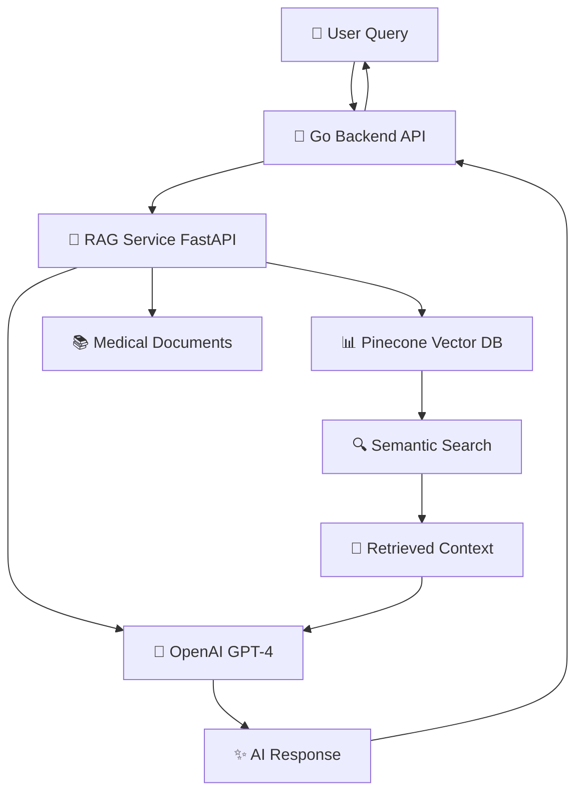

# 👁️ EyeQcheck RAG Service

<div align="center">


**AI-Powered Eye Examination Assistant with Retrieval-Augmented Generation**

_Providing intelligent, context-aware responses for eye health queries using medical knowledge retrieval and large language models._

</div>

---

## 🏥 **Overview**

EyeQcheck RAG Service is the intelligent brain behind our AI-powered eye examination system. It combines:

- 📚 **Medical Knowledge Retrieval** from curated eye examination documents
- 🤖 **Large Language Model Integration** (OpenAI GPT-4)
- 🔍 **Semantic Search** using Pinecone vector database
- ⚡ **Fast API Responses** with async FastAPI framework

### 🎯 **Core Capabilities**

- **Medical Q&A**: Answer questions about eye examinations, symptoms, and procedures
- **Document Retrieval**: Find relevant medical information from knowledge base
- **Multi-Modal Support**: Text-based queries with future vision support
- **Context-Aware Responses**: Maintain conversation context for better assistance

---

## 🏗️ **Architecture**



### 🔄 **Request Flow**

1. **User** asks eye examination question
2. **Go Backend** forwards to RAG service
3. **RAG Service** searches medical knowledge in Pinecone
4. **Retrieved context** + user query sent to LLM
5. **AI-generated response** returned through the chain

---

## 📁 **Example: Project Structure **

```
rag-service/
├── 📄 main.py                    # FastAPI application entry point
├── 📄 requirements.txt           # Python dependencies
├── 📄 .env.example              # Environment variables template
├── 📄 README.md                 # This file
├── 📄 document.md               # Work assignment documentation
│
├── 📂 app/
│   ├── 📄 __init__.py
│   │
│   ├── 📂 api/                  # API route definitions
│   │   ├── 📄 __init__.py
│   │   └── 📂 routes/
│   │       ├── 📄 __init__.py
│   │       ├── 📄 chat.py       # Main chat endpoint
│   │       ├── 📄 health.py     # Health check endpoint
│   │       └── 📄 stt.py        # Speech-to-text endpoint
│   │
│   ├── 📂 core/                 # Core application logic
│   │   ├── 📄 __init__.py
│   │   ├── 📄 config.py         # Configuration management
│   │   ├── 📄 logging.py        # Logging configuration
│   │   └── 📄 vectorstore.py    # Pinecone vector store manager
│   │
│   ├── 📂 models/               # Data models and schemas
│   │   ├── 📄 __init__.py
│   │   └── 📄 schemas.py        # Pydantic models
│   │
│   ├── 📂 services/             # Business logic services
│   │   ├── 📄 __init__.py
│   │   ├── 📄 llm.py           # LLM provider abstraction
│   │   ├── 📄 rag.py           # RAG orchestration service
│   │   └── 📄 retrieval.py     # Document retrieval service
│   │
│   └── 📂 utils/                # Utility functions
│       └── 📄 __init__.py
│
├── 📂 knowledge/                # Medical documents (add your docs here)
│   ├── 📄 eye_examination_guide.txt
│   ├── 📄 vision_tests.md
│   └── 📄 ...more medical docs
│
├── 📂 tests/                    # Test files
│   ├── 📄 __init__.py
│   ├── 📄 test_api.py
│   ├── 📄 test_rag.py
│   └── 📄 test_retrieval.py
│
└── 📂 docs/                     # Documentation
    ├── 📄 api_reference.md
    ├── 📄 deployment.md
    └── 📄 development.md
```

---

## 🚀 **Quick Start**

### 📋 **Prerequisites**

- Python 3.9+ 🐍
- OpenAI API Key 🔑
- Pinecone API Key 📌
- Go Backend Service (running) 🔧

### ⚡ **Installation**

1. **Clone the repository**

   ```bash
   git clone <repository-url>
   cd eyeQcheck/rag-service
   ```

2. **Create virtual environment**

   ```bash
   python -m venv venv
   source venv/bin/activate  # On Windows: venv\Scripts\activate
   ```

3. **Install dependencies**

   ```bash
   pip install -r requirements.txt
   ```

4. **Set up environment variables**

   ```bash
   cp .env.example .env
   # Edit .env with your API keys
   ```

5. **Add medical documents**

   ```bash
   # Place your eye examination documents in knowledge/ folder
   mkdir -p knowledge
   # Add .txt, .md, or .pdf files with medical content
   ```

6. **Run the service**
   ```bash
   uvicorn main:app --reload --host 0.0.0.0 --port 8001
   ```

### 🔧 **Environment Variables**

```bash
# .env file
OPENAI_API_KEY=your_openai_api_key_here
PINECONE_API_KEY=your_pinecone_api_key_here
PINECONE_ENVIRONMENT=your_pinecone_environment
PINECONE_INDEX_NAME=eyeqcheck-medical-docs

# Optional LLM Provider Settings
LLM_PROVIDER=openai  # or claude
ANTHROPIC_API_KEY=your_anthropic_key  # if using Claude

# Application Settings
LOG_LEVEL=INFO
CORS_ORIGINS=http://localhost:3000,http://localhost:8000
```

---

## 📚 **API Documentation**

### 🔗 **Endpoints**

| Method | Endpoint        | Description               |
| ------ | --------------- | ------------------------- |
| `POST` | `/api/chat-rag` | Main RAG chat endpoint    |
| `GET`  | `/api/health`   | Health check              |
| `POST` | `/api/stt`      | Speech-to-text conversion |

### 💬 **Chat API Example**

```bash
curl -X POST "http://localhost:8001/api/chat-rag" \
     -H "Content-Type: application/json" \
     -d '{
       "messages": [
         {"role": "user", "content": "What are the common symptoms of myopia?"}
       ],
       "temperature": 0.7
     }'
```

**Response:**

```json
{
  "reply": "Myopia, commonly known as nearsightedness, has several characteristic symptoms: 1. Difficulty seeing distant objects clearly while near vision remains good...",
  "thread_id": "thread_abc123",
  "error": null,
  "structured_data": null
}
```

### 📖 **Interactive Documentation**

- **Swagger UI**: `http://localhost:8001/docs`
- **ReDoc**: `http://localhost:8001/redoc`

---

## 🛠️ **Development**

### 🏃‍♂️ **Running in Development Mode**

```bash
# Install development dependencies
pip install -r requirements-dev.txt

# Run with auto-reload
uvicorn main:app --reload --host 0.0.0.0 --port 8001

# Run tests
pytest tests/ -v

# Code formatting
black app/ tests/
isort app/ tests/

# Linting
flake8 app/ tests/
mypy app/
```

### 🧪 **Testing**

```bash
# Run all tests
pytest

# Run with coverage
pytest --cov=app tests/

# Run specific test file
pytest tests/test_rag.py -v

# Run integration tests
pytest tests/test_integration.py -v
```

### 📝 **Adding New Medical Documents**

1. Add documents to `knowledge/` folder
2. Supported formats: `.txt`, `.md`, `.pdf`
3. Restart the service to reindex documents
4. Verify indexing in logs

---

## 🔧 **Configuration**

### ⚙️ **Core Settings** (`app/core/config.py`)

```python
class Settings:
    # API Settings
    app_name: str = "EyeQcheck RAG Service"
    debug: bool = False
    cors_origins: List[str] = ["*"]

    # LLM Settings
    openai_api_key: str
    openai_model: str = "gpt-4-turbo"
    temperature: float = 0.7
    max_tokens: int = 1024

    # Vector Database
    pinecone_api_key: str
    pinecone_environment: str
    pinecone_index_name: str = "eyeqcheck-medical"

    # Document Processing
    chunk_size: int = 500
    chunk_overlap: int = 50
    embedding_model: str = "text-embedding-3-large"
```

### 🎛️ **Customizing RAG Behavior**

**Temperature Control:**

- `0.1-0.3`: Factual, precise medical information
- `0.4-0.6`: Balanced responses
- `0.7-0.9`: More creative, conversational

**Chunk Size Optimization:**

- Small chunks (200-300): Precise information retrieval
- Medium chunks (400-600): Balanced context
- Large chunks (800-1000): Comprehensive context

---

## 🚢 **Deployment**

### 🐳 **Docker Deployment**

```dockerfile
# Dockerfile
FROM python:3.9-slim

WORKDIR /app
COPY requirements.txt .
RUN pip install -r requirements.txt

COPY . .
EXPOSE 8001

CMD ["uvicorn", "main:app", "--host", "0.0.0.0", "--port", "8001"]
```

```bash
# Build and run
docker build -t eyeqcheck-rag .
docker run -p 8001:8001 --env-file .env eyeqcheck-rag
```
